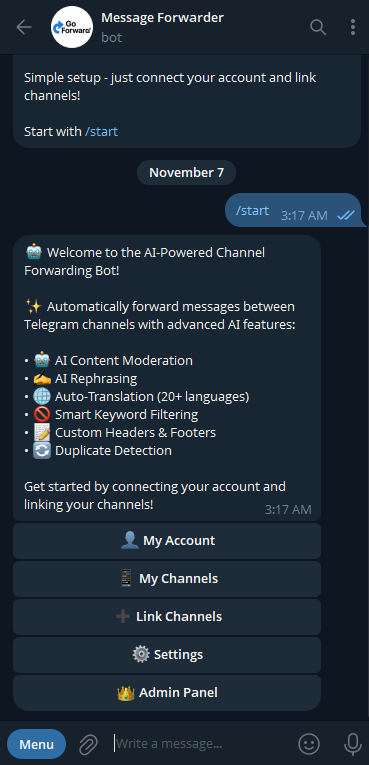
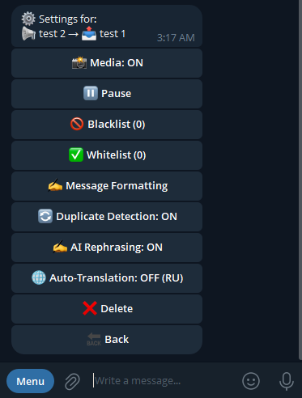

# 🚀 Message Forwarder - Smart Telegram Channel Automation

### Automate your channels with AI-powered forwarding • Zero effort • Zero coding

**🎁 100% FREE - All Features Included**

> ⚡ No hidden fees. No premium tiers. Just powerful automation for your Telegram channels.

**👉 [@go_forwardbot](https://t.me/go_forwardbot) on Telegram**

---

## 🎯 See It In Action

<table>
<tr>
<th align="center">🖥️ Main Dashboard</th>
<th align="center">⚙️ Channel Controls</th>
</tr>
<tr>
<td align="center"></td>
<td align="center"></td>
</tr>
<tr>
<td align="center"><strong>Your Command Center</strong> Manage everything from one simple interface. Connect accounts, link unlimited channels, and customize settings with one tap.</td>
<td align="center"><strong>Total Control</strong> AI translation (20+ languages), smart filters, duplicate detection, custom formatting, and more—all per channel.</td>
</tr>
</table>

**[🚀 Try it now - @go_forwardbot](https://t.me/go_forwardbot)**

---

## ✨ What You Get FREE

🤖 **AI Translation** - Reach 20+ languages instantly (Arabic, English, French, Spanish, Chinese, etc.)  
✍️ **AI Rephrasing** - Make every post unique and fresh  
🎯 **Smart Filters** - Blacklist/whitelist keywords, block duplicates  
📱 **Unlimited Channels** - Connect as many as you need  
⚡ **Auto-Sync** - Edits and deletes update everywhere  
🎨 **Custom Formatting** - Headers, footers, remove links/mentions  
📊 **Statistics** - Track all your forwarding activity  
🌍 **Multi-Language** - Interface in English or Arabic

---

## 💡 Perfect For

✅ **Content Creators** - Cross-post to backup channels automatically  
✅ **Businesses** - Sync announcements across regional channels  
✅ **Community Managers** - Curate content from multiple sources  
✅ **News Organizations** - Distribute breaking news in multiple languages instantly

**[Start automating - @go_forwardbot](https://t.me/go_forwardbot)**

---

## 🎮 How It Works

**1.** Start [@go_forwardbot](https://t.me/go_forwardbot) on Telegram  
**2.** Forward one message from your source channel  
**3.** Forward one message from your destination channel  
**4.** Done! Messages flow automatically from now on.

> ⏰ **Setup time:** Less than 2 minutes  
> 💰 **Cost:** 100% FREE  
> 🔧 **Technical skills needed:** Zero

**[Get started in 2 minutes - @go_forwardbot](https://t.me/go_forwardbot)**

---

## ❓ Quick FAQ

**Is it really free?**  
Yes! All features are completely free with no hidden fees or premium tiers. **[Start now - @go_forwardbot](https://t.me/go_forwardbot)**

**Is my data safe?**  
Absolutely. Messages go through encrypted Telegram APIs. We never read, store, or sell your content.

**Do I need coding skills?**  
Not at all. If you can send a Telegram message, you can use this bot.

**How many channels can I connect?**  
Unlimited. Connect 1 or 100 channels—no restrictions.

**Can I control what gets forwarded?**  
Completely. Use keyword filters, media toggles, duplicate detection, and scheduling.

---

## 🔥 Ready to Automate?

> **Start forwarding in under 2 minutes.** No credit card. No setup hassles. Just instant automation.

### 👇 Start Automating Your Channels Now 👇

**Bot:** [@go_forwardbot](https://t.me/go_forwardbot)  
**Direct Link:** [t.me/go_forwardbot](https://t.me/go_forwardbot)  
**Support:** [@reeeeeda](https://t.me/reeeeeda)

---

**Made with ❤️ for the Telegram community** • [Start Free Now](https://t.me/go_forwardbot) • No Limits • No Fees
